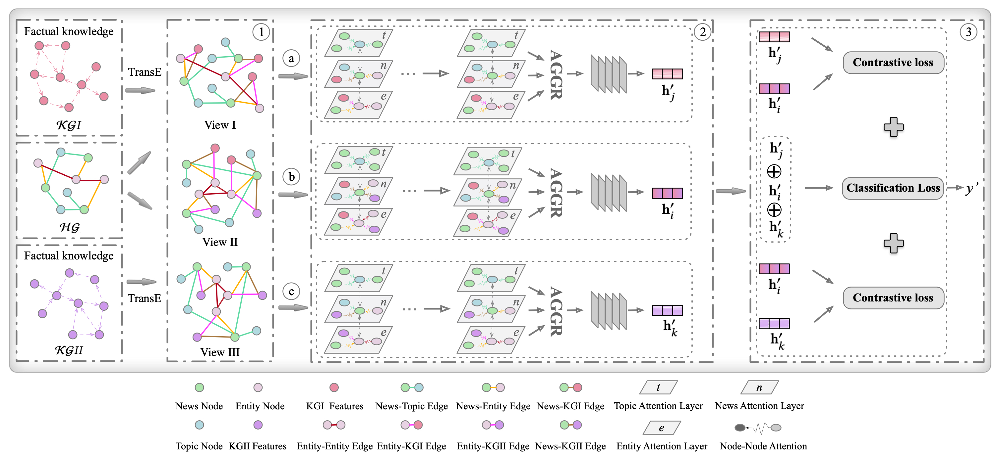

  
   

<h1> Contrastive Multi-Knowledge Graph Learning for Fake News Detection </h1>

Open-sourced implementation for Contrastive Multi-Knowledge Graph Learning for Fake News Detection - Congrat.

<h2> Python Dependencies </h2>

Our proposed Congrat framework is implemented in Python 3.7 and major libraries include: 

* [Pytorch](https://pytorch.org/) = 1.11.0+cu102
* [PyG] (https://pytorch-geometric.readthedocs.io/en/latest/) torch-geometric=2.1.0

More dependencies are provided in requirements.txt.

<h2> To Run </h2>

`python src/main.py`

<h2> Experimental Results </h2>

The experimental results will be open when the article is accepted.
